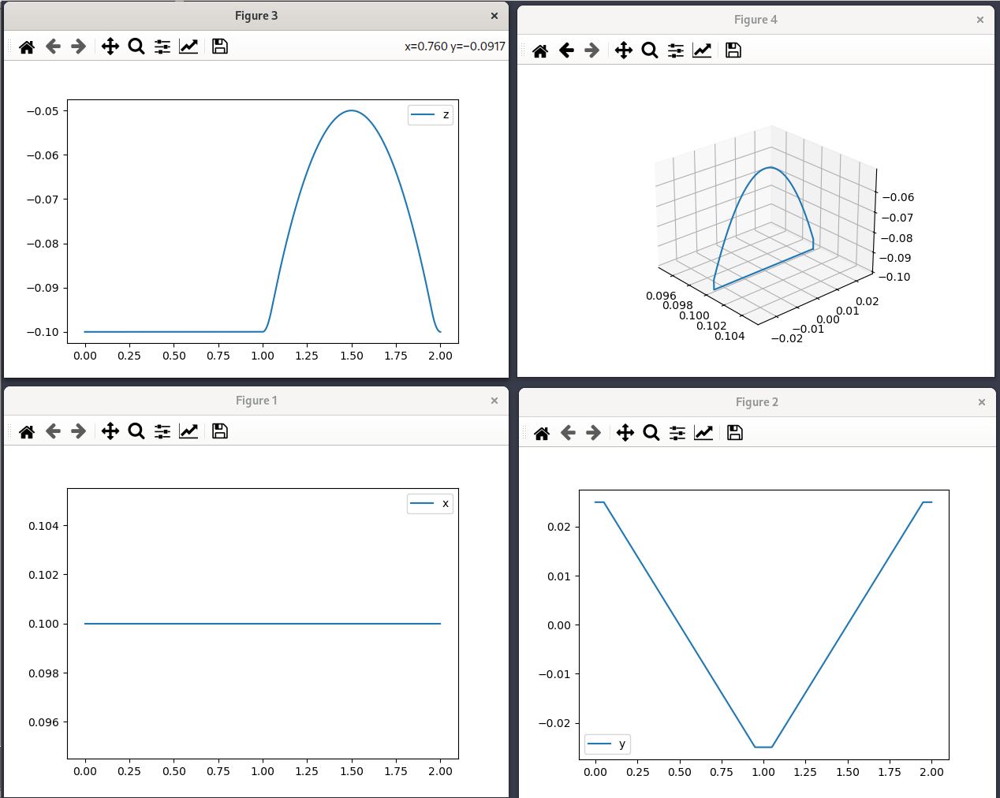
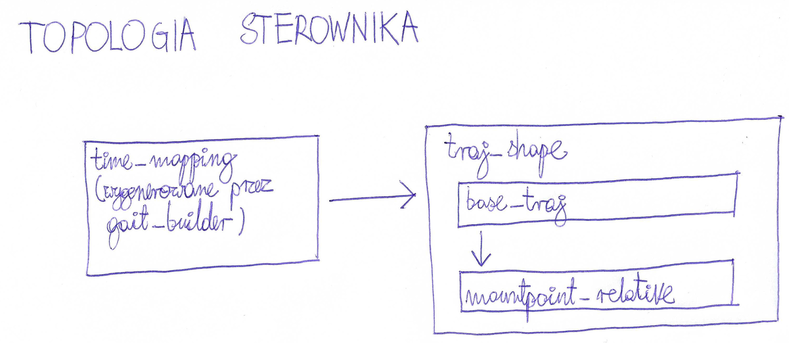

# Advanced Controller

## Generowana trajektoria

Trajektorie nóg są funkcjami sklejanymi z wielomianów. Ponieważ nogi nie są
podnoszone natychmiastowo, trzeba zatrzymać ruch na chilę, opuścić
pewne nogi, podnieść inne nogi i wznowić ruch.

## Sposób generowania trajektorii

Sterownik pozwala niezależnie sterować:
* Chodem (sekwencją przestawiania nóg)
* Parametrami chodu (rozstaw nód, prędkość, prędkość kątowa robota)
* Ustawieniem korpusu (wysokość zawieszenia, pozycja korpusu, kąty eulera orientacji)

Topologia sterownika odpowiada temu podziałowi.

Na początku generowana jest bazowa trajektoria (względem punktu bazowego).
Później jest stosowana zmiana układu współrzędnych wzg. mountpointu.
W ten sposób generowany jest znormalizowany kształt trajektorii.
Poprzez odpowiednie mapowanie czasu na kształt trajektorii uzyskujemy
różne chody.
